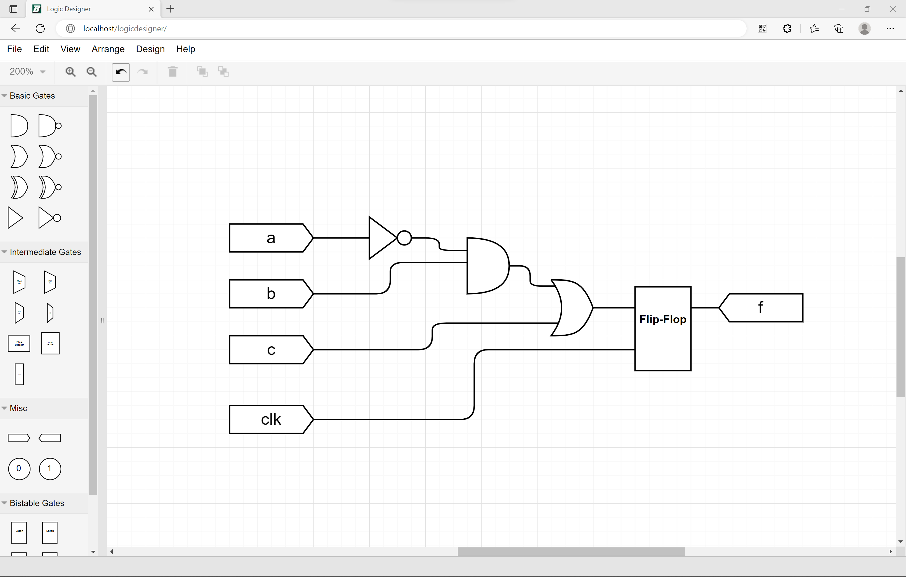

# LogicDesigner
A web-based educational digital logic schematic capture and simulation tool.
## Introduction
LogicDesigner is a web-based schematic capture and functional simulation tool for teaching digital logic design, developed in the Electrical and Computer Engineering department at Binghamton University.  While schematic capture is no longer the predominant method of designing digital circuits, it remains an effective teaching tool.  Many commercial tools no longer feature schematic capture and thus LogicDesigner was developed.  

## Features
LogicDesigner features include
- A drag-and-drop interface for schematic capture with simple point-to-point wiring and common editing features such as auto-arrange.
- File save and load.
- Basic logic gates (AND, OR, XOR, etc) that feature dynamic input countss.  Adding a wire increase the input count up to eight inputs.
- Intermediate gates, including multiplexers and decoders.
-Bistable gates, including D-latch, D-FlipFlop, and SR-Latch (with and without enables)
- A Design Rule Check (DRC), which warns of design problems such as unconnected required inputs
-A simulation mode, which attaches a switch to each input port and LED to each output port, allowing the used to test the functionality of their circuit.  Nets and gates that are logically-high are automatically colored in green to aid in understanding the functionality.
- Exporting the design to structural VHDL

## Installation and Use
Download the repository to a web-server and open index.html.
